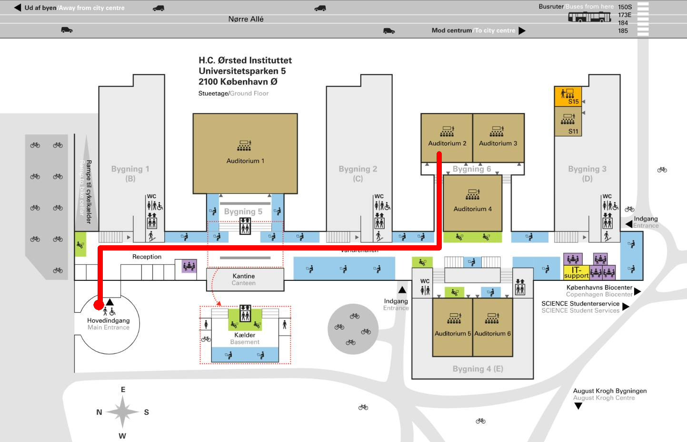

# CoPLaWS 2026 - the 4th Copenhagen Programming Languages Workshop

[CoPLaWS](https://coplaws.github.io) is a series of annual workshops for
programming language researchers working in the greater Copenhagen area, open to
academics (DTU, KU, ITU, RUC, AAU CPH) and researchers in industry and other
institutions. The aim is to get together and learn about each other's work.

**[CoPLaWS 2026](https://coplaws.github.io/2026)** is the fourth edition of the workshop. It will take place on

- **a turrently DBA date in August** in **Copenhagen** at University of
  Copenhagen, at a room TBA>.

It will be a full-day event with an optional dinner. More information on the
dinner will be announced in the future.

## Invited Speaker

There will be an invited speaker.

## Programme

TBA

## Call for Talks

We invite the submission of abstracts for 20-minute talks on all topics related
to programming language research.

We encourage also PhD students to submit proposals! We encourage also
presentations of work-in-progress research!

Since there are many programming language researchers in Copenhagen, it is
possible that we will get more talk proposals than can fit in a day. In that
event, the talks will be selected by the organisers based on a light reviewing
process. We will aim for diversity in topics and institutions represented.

Talk proposals should consist of a title and a one-paragraph abstract. No need
to submit any PDF.

- **Talk proposal submission link:** TBA
- **Talk proposal submission deadline:** 10 August 2026
- **Notification:** 12 August 2026
- **Participation registration link:** TBA
- **Participation registration deadline:** 13 August 2026
-->

## The room

The venue is in the **HCØ Building** at **Universitetsparken 5**, in
**Auditorium 03**. The map below shows the path from the front entrance to the
auditorium.

## Parking

TBA

## CoPLaWS Dinner

While participation in CoPLaWS is free, the dinner is at the participants' own
expense. More information is TBA.

## Local Organisers

Troels Henriksen (<a href="mailto:athas@diku.dk">athas@diku.dk</a>).

## Organisers

TBA

## Sponsor

Your name here?
